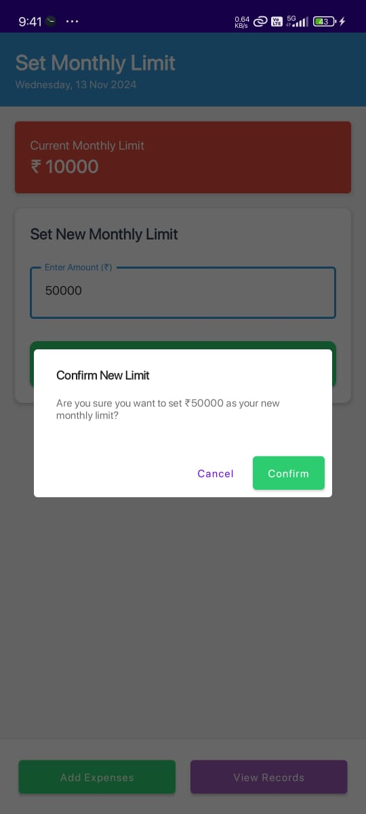

# Expense Tracker

## Project Overview

Expense Tracker is an Android application designed to help users track their daily personal expenses. The app allows users to input the cost of each item they buy, categorize their expenses, and view a summary of their spending patterns over time. With a user-friendly interface and powerful features, the app helps users manage their finances more effectively.

The core objective of this application is to provide users with an intuitive tool for recording their expenses and visualizing their financial behavior. Whether you're tracking groceries, entertainment, or transportation costs, this app aims to streamline how you manage your finances.

### Key Features
- **Add Item Expenses:** Easily add expenses for each item purchased, specifying item names, amounts, and categories.
- **Set Monthly Limit:** Set a monthly spending limit to help manage your budget throughout the month.
- **Date Filtering:** Filter expenses by specific time periods (daily, weekly, monthly) for detailed insights. *(This feature is currently under development.)*
- **Expense History:** View a comprehensive list of past expenses, including item names, amounts, and dates.

## Screenshots

Here are some screenshots of the application to showcase the app's UI and features:

1. **Home Screen**  
   
   
2. **Add Item Expense Screen**  
   

3. **Set Monthly Limit**  
   

4. **Expense History View**  
   

## Demo
For a video demo check out the project on 
[Google Drive](https://drive.google.com/drive/folders/1iq0oMk3CFskEp76yJm5M3wLT0hSYs7S3?usp=sharing).

## Installation Instructions

Follow these steps to set up the project on your local machine.

### Prerequisites

To get started with this project, you'll need the following tools installed on your system:

- **Android Studio**: Latest version.
- **JDK 8 or higher**: Ensure you have the Java Development Kit installed.
- **Gradle 6.x or later**: Required to build the project.
- **Android Device or Emulator**: For testing and running the app.

### Clone the Repository

To clone this project to your local machine, run the following command in your terminal:

```bash
git clone https://github.com/madhanraj-veerakumar/Android-Project.git
